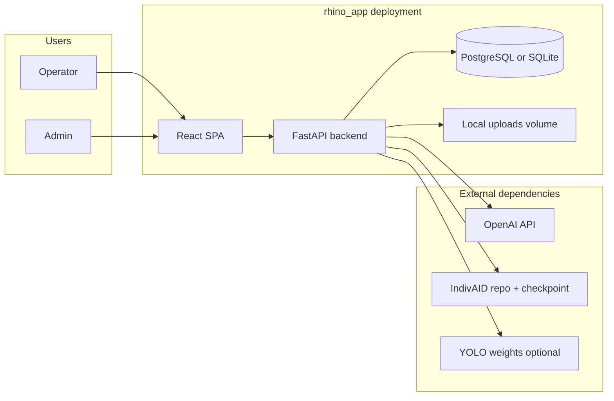

# Architecture — rhino_app (Rhino Re-ID)

**Author:** Roy  
**Date:** 2026-03-23  
**Sources:** PRD (`prd.md`), `docs/DOCUMENTATION.md`, `_bmad-output/project-context.md`, brownfield codebase.

**Purpose:** Single technical reference for implementation and AI agents: system shape, boundaries, key decisions, and where FRs land in code.

---

## 1. System context

**Context:** Operators and admins use a browser SPA. The backend owns auth, business logic, persistence, and static serving of uploaded files. Re-ID inference uses in-repo `ai_core` (Torch + IndivAID code on `PYTHONPATH`) or a subprocess to IndivAID’s script; both require checkpoint files and a gallery directory layout on disk. LLM description features call OpenAI. Optional YOLO supports crop suggestions.

---

## 2. Container view

| Container | Responsibility | Tech |
|-----------|----------------|------|
| **SPA** | Login, gallery, Re-ID batch UI, image detail | React 19, Vite 7, TypeScript strict, react-router-dom 7 |
| **API** | REST API, JWT, static `/uploads`, orchestration | FastAPI, Uvicorn, Pydantic v2 |
| **Worker (logical)** | None separate today; Re-ID runs **in API process** (thread pool / sync subprocess) | — |
| **Database** | Users, lists, identities, images, predictions, description versions | SQLAlchemy 2 async + asyncpg / aiosqlite |
| **Object storage** | Local filesystem under `backend/uploads/` | Paths stored in DB |

**Dev wiring:** Vite proxies `/api` → backend (path rewrite strips `/api`) and `/uploads` → backend. Production must align same-origin or CORS.

---

## 3. Key architectural decisions (ADRs)

### ADR-1 — Monolith API + SPA (no separate BFF)

**Decision:** Single FastAPI app exposes all HTTP APIs; React talks to it via JSON and Bearer JWT.

**Rationale:** Small team footprint; PRD MVP scope; OpenAPI at `/docs` for integrators.

**Trade-off:** Scaling Re-ID CPU load scales the API process; acceptable until traffic grows.

---

### ADR-2 — Async SQLAlchemy for all DB access in routers

**Decision:** Routers use `AsyncSession` and `await` for queries/commits.

**Rationale:** Non-blocking I/O under concurrent users; matches FastAPI style.

**Constraint:** Re-ID and YOLO may use threadpool or subprocess to avoid blocking the event loop where heavy CPU work exists.

---

### ADR-3 — File-backed gallery and predictions

**Decision:** Image bytes live on disk; DB stores relative paths under `UPLOAD_DIR`.

**Rationale:** Large binaries; simple ops; IndivAID expects directory layouts (`train/`, `gallery/`).

**Implication:** Backup strategy must include DB + volume; path migration requires file moves + DB updates.

---

### ADR-4 — Re-ID: `ai_core` in-process with subprocess fallback

**Decision:** Prefer `ai_core.reid_engine.run_set_to_set_reid` when Torch + IndivAID imports work and gallery has `train/` + `gallery/`; else invoke `IndivAID/app_reid_top5.py` with timeout.

**Rationale:** Developer machines without GPU still run; parity with standalone eval scripts.

**Known limitation:** Subprocess path uses a fixed temp output file in some builds—concurrent predictions may race (documented in `project-context.md`).

---

### ADR-5 — Auth: JWT + role string

**Decision:** OAuth2 password flow issues JWT (`sub` = username); `User.role` is `admin` | `user`.

**Rationale:** Stateless API; simple admin checks (`require_admin`).

**Security note:** Rotate `SECRET_KEY` and default admin password before production (PRD SC-6).

---

### ADR-6 — Rate limiting for predict (non-admin)

**Decision:** In-memory sliding window per user ID for predict routes; admins exempt.

**Rationale:** Abuse mitigation without Redis dependency in MVP.

**Trade-off:** Not durable across processes; multi-instance deploy needs shared limiter later.

---

## 4. Logical modules and code map

| Module | Path | Role |
|--------|------|------|
| App entry | `backend/app/main.py` | Routers, CORS, lifespan DB create, optional `/uploads` mount, schema patches |
| Config | `backend/app/config.py` | Pydantic settings, `.env`, IndivAID paths, Re-ID toggles |
| Models | `backend/app/models.py` | Users, lists, identities, images, description versions, predictions |
| Auth | `backend/app/auth.py` | JWT, bcrypt, rate limit |
| Routers | `backend/app/routers/*.py` | auth, lists, gallery, predict, crop |
| Services | `backend/app/services/` | `predict`, `describe`, `crop`, `auto_crop_bbox`, `init_high_quality` |
| Re-ID engine | `ai_core/reid_engine.py` | In-process set-to-set retrieval |
| Frontend | `frontend/src/` | `App.tsx`, `pages/`, `api.ts`, `contexts/` — global styles in `index.css` |
| Scripts | `backend/*.py` | DB init, sync/migrate datasets |

**UI presentation:** Styling is hand-rolled CSS (no component library in MVP). Planned refreshes and design tokens: **`docs/UI_UPDATE_AND_DESIGN_SYSTEM.md`** (repository root).

---

## 5. Data architecture (summary)

**Core entities:**

- **User** — credentials, role, active flag.
- **RhinoList** — grouping (`high_quality` | `images`).
- **RhinoIdentity** — display name, optional ATRW `pid`, active flag.
- **RhinoImage** — file path, part type, parent capture, `source_stem`, JSON descriptions, confirmed/active.
- **RhinoDescriptionVersion** — versioned four-part text tied to anchor image.
- **PredictionRecord** — query path, top1 link, top5 JSON blob, confirmed/reported/corrected identity fields.

**Schema evolution:** `main.py` applies additive `ALTER TABLE` for legacy DBs; new columns must stay aligned with `models.py`.

---

## 6. API surface (grouped)

| Group | Prefix | Concerns |
|-------|--------|----------|
| Auth | `/auth` | login, register, me |
| Lists | `/lists` | lists and identities CRUD, migrate |
| Gallery | `/gallery` | identities/images CRUD, uploads, descriptions, versions, export |
| Predict | `/predict` | describe-file, upload, upload-set, confirm, report, assign, top, history |
| Crop | `/crop` | server crop, bbox suggest |

**Static:** `/uploads/**` when `UPLOAD_DIR` exists.

---

## 7. Cross-cutting concerns

**Language:** English-only API messages and UI (`docs/LANGUAGE_POLICY.md`).

**Observability:** Structured logging in services; no mandated APM in MVP.

**Errors:** Predict/describe return explicit JSON errors when weights or IndivAID root missing.

**CORS:** Dev origins `localhost:5173` / `127.0.0.1:5173` in `main.py`.

---

## 8. FR → component mapping (from PRD)

| FR | Primary implementation |
|----|-------------------------|
| FR-1 | `auth_router`, `auth.py`, `AuthContext.tsx` |
| FR-2 | `predict_router`, `services/predict.py`, `ai_core/reid_engine.py` |
| FR-3 | `services/describe.py`, `predict_router` / `gallery_router` |
| FR-4 | `predict_router` confirm |
| FR-5 | `predict_router` report |
| FR-6 | `predict_router` history |
| FR-7–FR-8 | `gallery_router`, `Gallery.tsx`, `RhinoImageDetail.tsx` |
| FR-9 | `require_admin` on gallery routes |
| FR-10 | `check_predict_rate_limit` |
| FR-11 | `PredictionRecord` + `_persist_reid_prediction` |
| FR-12 | FastAPI `/docs` |

---

## 9. Deployment assumptions (non-prescriptive)

- Single VM or container pair (frontend static + API) or dev split (Vite + uvicorn).
- **PostgreSQL** preferred for production; SQLite acceptable for dev.

---

## 10. Consistency rules for AI agents

1. **Follow** `_bmad-output/project-context.md` and PRD; do not introduce non-English user-facing strings under `rhino_app/`.
2. **New HTTP surface** → add router under `backend/app/routers/`, register in `main.py`, extend `frontend/src/api.ts` if needed.
3. **Heavy ML** → extend `services/` or `ai_core/`; keep routers thin.
4. **DB changes** → update `models.py` + migration strategy (`init_db` / `ALTER` hook) consistently.
5. **Secrets** → only via `.env` / environment; never commit.

---

## 11. Next steps (BMad)

1. **`bmad-bmm-create-epics-and-stories`** — decompose PRD FRs using this architecture.
2. **`bmad-bmm-check-implementation-readiness`** — PRD + architecture + epics alignment.
3. **`bmad-help`** — route optional follow-ups.

---

_Architecture workflow complete. This document is the technical single source of truth until superseded by a deliberate revision._
